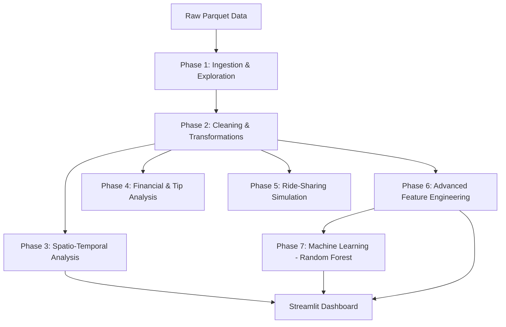

# 🚕 NYC Taxi Analysis & Price Predictor

**A Big Data Pipeline for NYC Taxi Trip Data using Apache Spark (Scala) and Streamlit (Python).**

## 📖 Project Overview

This project provides a comprehensive end-to-end Big Data pipeline for analyzing New York City's taxi trip data. It covers everything from initial data ingestion and cleaning to advanced spatio-temporal analysis, ride-sharing simulations, and predictive modeling using Machine Learning. The final insights are visualized through an interactive Streamlit dashboard.

---

## 🛠️ Technology Stack

- **Data Processing**: [Apache Spark](https://spark.apache.org/) (Scala 2.12+)
- **Storage Format**: [Apache Parquet](https://parquet.apache.org/) & CSV
- **Visualization**: [Streamlit](https://streamlit.io/) (Python)
- **Machine Learning**: [Spark MLlib](https://spark.apache.org/mllib/)
- **Build Tool**: [sbt](https://www.scala-sbt.org/)
- **Data Source**: NYC TLC Trip Record Data

---

## 🏗️ Project Architecture



---

## 🚀 Detailed Project Phases (Scala Utilities)

Each phase is implemented as a standalone Scala object, allowing for modular execution and testing.

### 1. [TaxiPhase1.scala](src/main/scala/TaxiPhase1.scala) - Ingestion & Exploration
*   **Utility**: Initial entry point for data handling.
*   **Key Functions**:
    *   Loads raw NYC Taxi data from Parquet files.
    *   Calculates global statistics: total number of trips, time period coverage.
    *   Performs data profiling: identifies NULL values per column and counts basic outliers (negative distances, fares, etc.).
    *   **Output**: `output/phase1_results.txt`

### 2. [TaxiPhase2.scala](src/main/scala/TaxiPhase2.scala) - Cleaning & Transformations
*   **Utility**: Data quality assurance and basic enrichment.
*   **Key Functions**:
    *   Filters out invalid records (NULL timestamps, non-positive distances/passengers).
    *   Computes derived columns: `trip_duration` (minutes) and `average_speed` (km/h).
    *   Categorizes trips into `short_trip` vs `long_trip`.
    *   **Output**: `output/phase2_results.txt`

### 3. [TaxiPhase3.scala](src/main/scala/TaxiPhase3.scala) - Spatio-Temporal Analysis
*   **Utility**: Spatial intelligence and trend analysis.
*   **Key Functions**:
    *   Joins taxi trip data with the `taxi_zone_lookup.csv` to replace LocationIDs with human-readable Borough/Zone names.
    *   Identifies top pickup/dropoff zones.
    *   Calculates hourly/daily activity patterns.
    *   Extracts "Spatio-Temporal Hotspots" (busiest hour/zone combinations).
    *   **Output**: `output/phase3_results.txt` and `output/heatmap_pickup_hour.csv` (used by Streamlit).

### 4. [TaxiPhase4.scala](src/main/scala/TaxiPhase4.scala) - Financial & Tip Analysis
*   **Utility**: Economic behavior modeling.
*   **Key Functions**:
    *   Explores the distribution of payment types (Credit Card, Cash, etc.).
    *   Calculates average tip amounts and tip percentages relative to fare.
    *   Correlates tipping behavior with time of day and day of week.
    *   **Output**: `output/phase4_results.txt`

### 5. [TaxiPhase5.scala](src/main/scala/TaxiPhase5.scala) - Ride-Sharing Simulation
*   **Utility**: Proof-of-concept for urban mobility optimization.
*   **Key Functions**:
    *   Identifies carpooling potential by grouping trips with similar pickup times (10-minute windows) and the same startup zone.
    *   Simulates potential gains: estimates savings in total distance (20%), fare (15%), and time (10%).
    *   **Output**: `output/phase5_results.txt`

### 6. [TaxiPhase6_Extension.scala](src/main/scala/TaxiPhase6_Extension.scala) - Advanced Feature Engineering
*   **Utility**: Preparing data for predictive modeling.
*   **Key Functions**:
    *   Creates advanced features: `is_peak_hour`, `tip_percentage`, and detailed `trip_category`.
    *   Implements complex anomaly detection (e.g., speed > 120 km/h, distance > 50km).
    *   **Output**: `output/phase6_extension_results.txt`

### 7. [TaxiPhase7_ML.scala](src/main/scala/TaxiPhase7_ML.scala) - Machine Learning (Price Predictor)
*   **Utility**: Predictive analytics.
*   **Key Functions**:
    *   Implements a Spark ML Pipeline using `StringIndexer`, `VectorAssembler`, and `RandomForestRegressor`.
    *   Trains a model to predict `total_amount` based on pickup/dropoff location, distance, hour, and day.
    *   Evaluates performance using **RMSE** and **R²** metrics.
    *   **Output**: `output/phase7_ml_results.txt`

### 8. [TaxiUtils.scala](src/main/scala/TaxiUtils.scala) - Common Utilities
*   **Utility**: Shared logic and configuration.
*   **Key Functions**:
    *   Centralized SparkSession creation.
    *   Hardcoded paths for data and model directories.
    *   Automatic creation of output directories.

---

## 📊 Streamlit Dashboard

The project includes a modern, interactive dashboard built with Python and Streamlit to visualize the results generated by the Spark pipeline.

-   **Rapport Spark**: Real-time viewing of the analysis reports.
-   **Tendances & Heatmap**: Interactive line charts of hourly activity and a density heatmap of pickup zones.
-   **Analyse Spatiale**: Bar charts of the most active zones in NYC.

To run the dashboard:
```bash
streamlit run streamlit_app.py
```

---

## ⚙️ How to Run

### Prerequisites
-   **Java 8 or 11**
-   **Scala 2.12.x**
-   **Apache Spark 3.x**
-   **sbt** (Scala Build Tool)
-   **Python 3.8+** (for Streamlit)

### Running the Analysis
1.  **Clone the repository.**
2.  **Build the project**:
    ```bash
    sbt clean compile
    ```
3.  **Run a specific phase** (e.g., Phase 7):
    ```bash
    sbt "runMain TaxiPhase7_ML"
    ```
    *Note: You can run any phase from `TaxiPhase1` to `TaxiPhase7_ML`.*

### Setting up the Dashboard
1.  **Install Python dependencies**:
    ```bash
    pip install streamlit pandas plotly seaborn matplotlib
    ```
2.  **Execute the dashboard**:
    ```bash
    streamlit run streamlit_app.py
    ```

---

## 👥 Authors
-   **Spark Taxi Team** - *Big Data & ML Project*

## 📜 License
This project is licensed under the MIT License.
